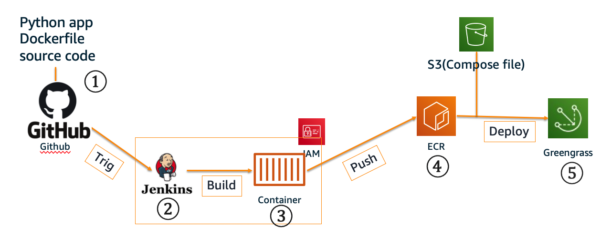
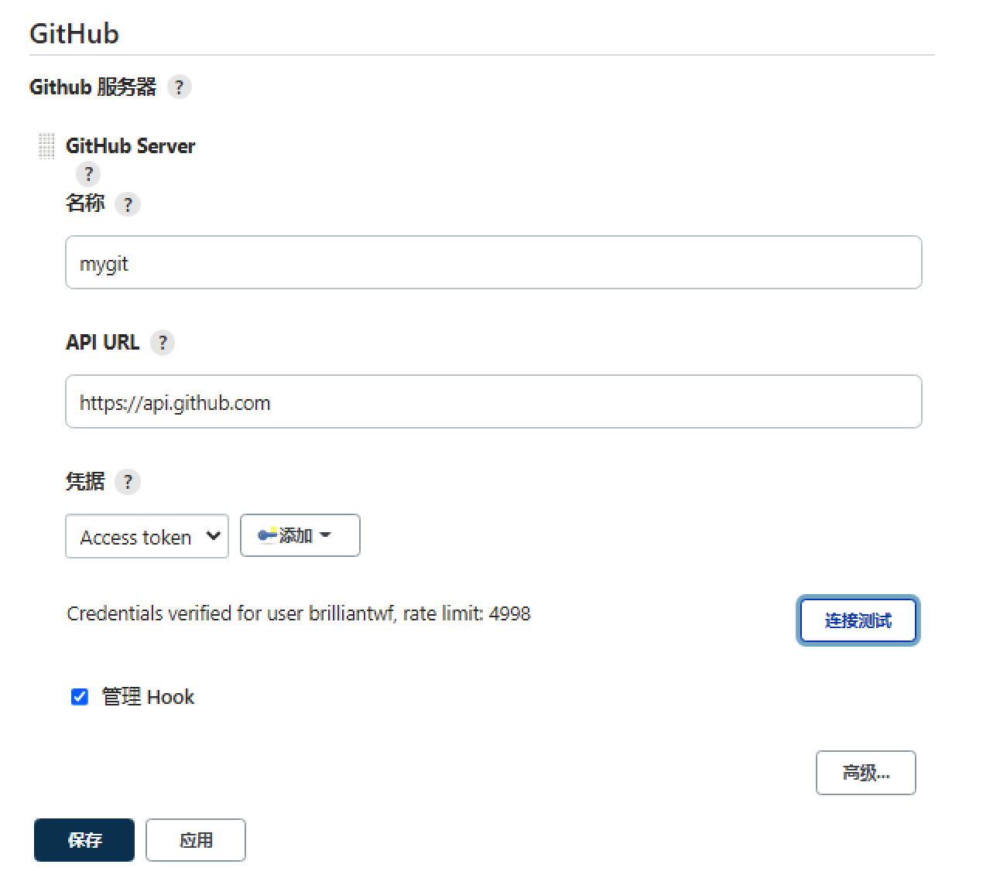
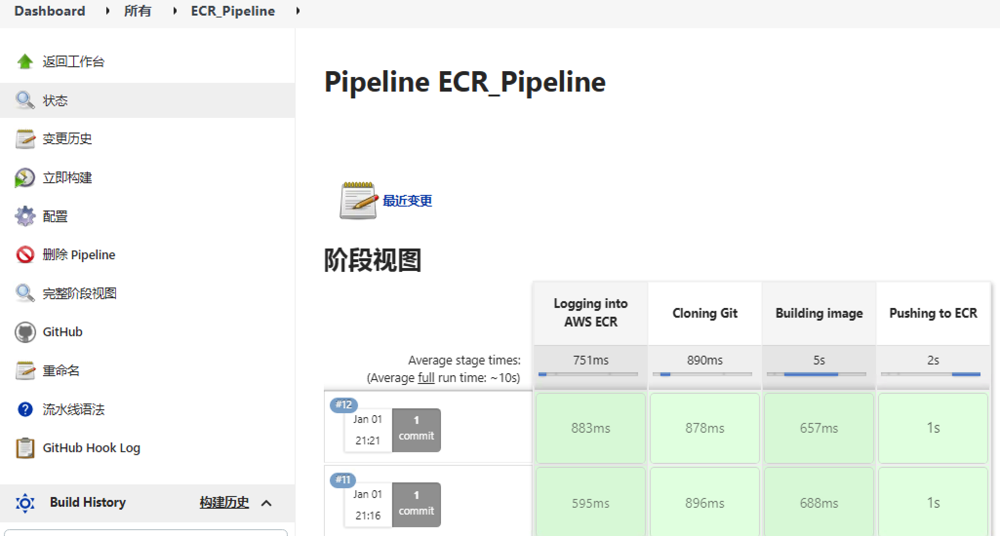
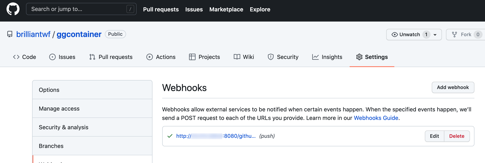
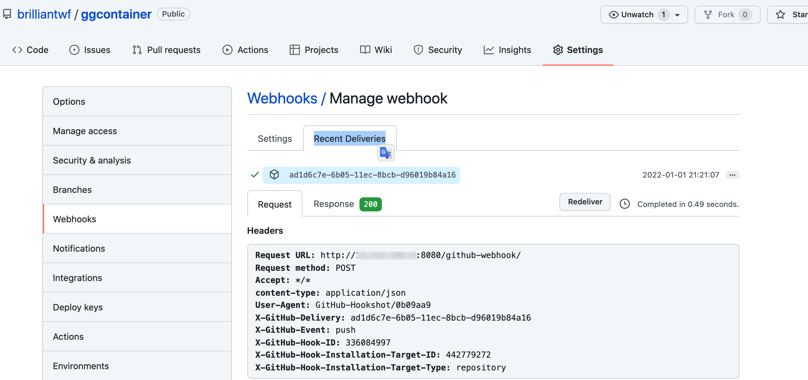
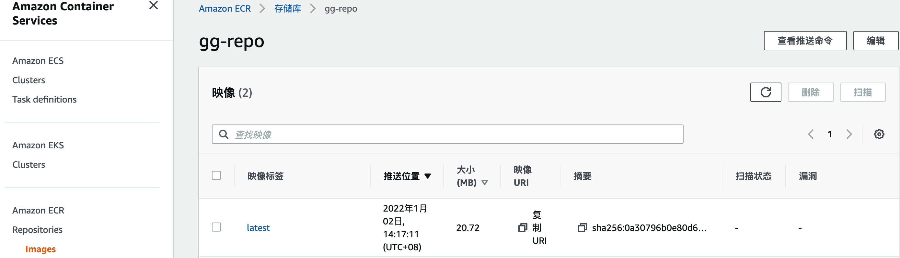
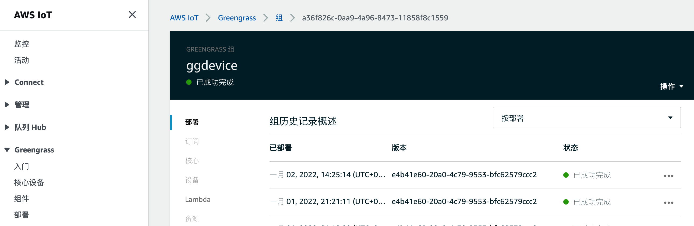
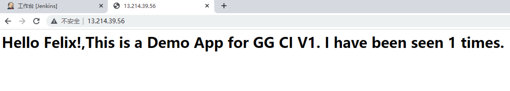

# 使用Jenkins和ECR为AWS IoT Greengrass边缘设备构建持续交付流水线
## 背景
AWS于2020年发布的Greengrass Docker Application Deployment连接器,可以将用户的应用通过容器化的方式推送到边缘侧.相较于以往边缘侧执行的Lambda,容器执行逻辑可以更加复杂,且运行方式更加灵活,而且借助ECR,边缘侧的容器也可以随时更新,此文主要介绍使用Jenkins和ECR构建持续交付流水线实现AWS IoT Greengrass 边缘侧容器应用的自动更新.
## 架构及流程
 

1. Github上托管容器相关代码,dockerfile,app.py,requirements等
2. Github上的更新和提交触发Jenkins pipeline,Jenkins pipeline开始构建容器
3. 构建容器结束后将容器推送至ECR仓库
4. ECR 仓库存储latest版本容器
5. AWS ioT greengrass 通过部署拉取最新的容器并使用S3上的Compose进行服务暴露
## 先决条件
1. 边缘设备AWS IoT Greengrass 安装,参考[安装文档](https://docs.aws.amazon.com/zh_cn/greengrass/v1/developerguide/install-ggc.html)
2. 在边缘设备上安装容器环境,包括Docker 和Docker Compose,参考[安装文档](https://docs.aws.amazon.com/zh_cn/AmazonECS/latest/developerguide/docker-basics.html)
3. 安装Jenkins环境,参考[安装文档](https://www.jenkins.io/doc/tutorials/tutorial-for-installing-jenkins-on-AWS/)
4. 安装和配置Greengrass Docker Application Deployment连接器,参考[此Blog](https://aws.amazon.com/cn/blogs/china/deploy-container-applications-to-iot-edge-with-aws-iot-greengrass-docker-application-deployment-deployment-connector/)
## 配置持续交付环境
以下部署在新加坡区域(ap-southeast-1)
### 1. 安装配置ECR
使用以下代码创建

```shell
aws ecr create-repository --repository-name gg-repo --region ap-southeast-1
aws ecr get-login-password --region ap-southeast-1 | docker login --username AWS --password-stdin Youaccount_.dkr.ecr.ap-southeast-1.amazonaws.com
```
### 2. 配置Github环境
注册Github账号,创建Repository并在Jenkins服务上初始化好Git Pull/Push环境
在账号设定-Personal access tokens 中配置一个带有repo和admin:repo_hook权限的token,并记录
### 3. 配置Jenkins环境

1. 安装和部署以下插件

- Docker 
- Docker pipelines
- GitHub API plugin. (默认已安装)
- GitHub plugin(默认已安装)

2. 配置相关选项
   - 全局安全设置中,配置**跨站请求伪造保护配置**,勾选**启用代理兼容**,否则后期出现403错误
   - 在凭据-系统-全局凭据 (unrestricted)中添加凭据,凭据类型选择"Secret Text",填入在Jenkins环境配置中生成的token
   - 系统配置中找到**Github服务器**,添加Github Server 在APP URL中填写https://api.github.com
   - 在凭据中选择第二步中生成的凭据
   - 勾选下方管理hook,点击**连接测试**进行测试
   - 点击保存并应用
  

3. 配置Jenkins Pipeline
    - 在Jenkins中创建一个新任务并选择Pipeline.
    - 在pipeline中,GitHub 项目中填入项目URL例如https://github.com/brilliantwf/ggcontainer.git/
    - 在构建触发器中,勾选**GitHub hook trigger for GITScm polling**
    - 在高级项目选项-pipeline中选择Pipeline Script
    - 在脚本中输入以下代码

```groovy
pipeline {
    agent any
    environment {
        AWS_ACCOUNT_ID="ACCOUNT_ID"
        AWS_DEFAULT_REGION="ap-southeast-1" 
        IMAGE_REPO_NAME="reponame"
        IMAGE_TAG="latest"
        GITHUB_REPO="github_project"
        REPOSITORY_URI = "${AWS_ACCOUNT_ID}.dkr.ecr.${AWS_DEFAULT_REGION}.amazonaws.com/${IMAGE_REPO_NAME}"
    }
    stages {
        
         stage('Logging into AWS ECR') {
            steps {
                script {
                sh "aws ecr get-login-password --region ${AWS_DEFAULT_REGION} | docker login --username AWS --password-stdin ${AWS_ACCOUNT_ID}.dkr.ecr.${AWS_DEFAULT_REGION}.amazonaws.com"
                }
                 
            }
        }
        
        stage('Cloning Git') {
            steps {
                checkout([$class: 'GitSCM', branches: [[name: '*/main']], doGenerateSubmoduleConfigurations: false, extensions: [], submoduleCfg: [], userRemoteConfigs: [[credentialsId: '', url: '${GITHUB_REPO}']]])     
            }
        }
  
    // Building Docker images
    stage('Building image') {
      steps{
        script {
          dockerImage = docker.build "${IMAGE_REPO_NAME}:${IMAGE_TAG}"
        }
      }
    }
   
    // Uploading Docker images into AWS ECR
    stage('Pushing to ECR') {
     steps{  
         script {
                sh "docker tag ${IMAGE_REPO_NAME}:${IMAGE_TAG} ${REPOSITORY_URI}:$IMAGE_TAG"
                sh "docker push ${AWS_ACCOUNT_ID}.dkr.ecr.${AWS_DEFAULT_REGION}.amazonaws.com/${IMAGE_REPO_NAME}:${IMAGE_TAG}"
         }
        }
      }
    }
}
```
4. 此时可以对Pipelie进行测试,如无报错即可进行后续
     
## 持续交付环境整体部署
1. 在github中配置新的代码,并使用提交
2. 此时检查在 中的webhook有无正确响应提示如下图
     
如出现Deliveries 错误,检查前期配置是否正确.在Recent Deliveries可以看到详细错误
  
3. 检查ECR中的容器是否已经更新.
     
4. 在AWS IoT Greengrass 界面中点击部署,稍等片刻等待部署完成
     
5. 访问应用测试应用是否已经更新
     


